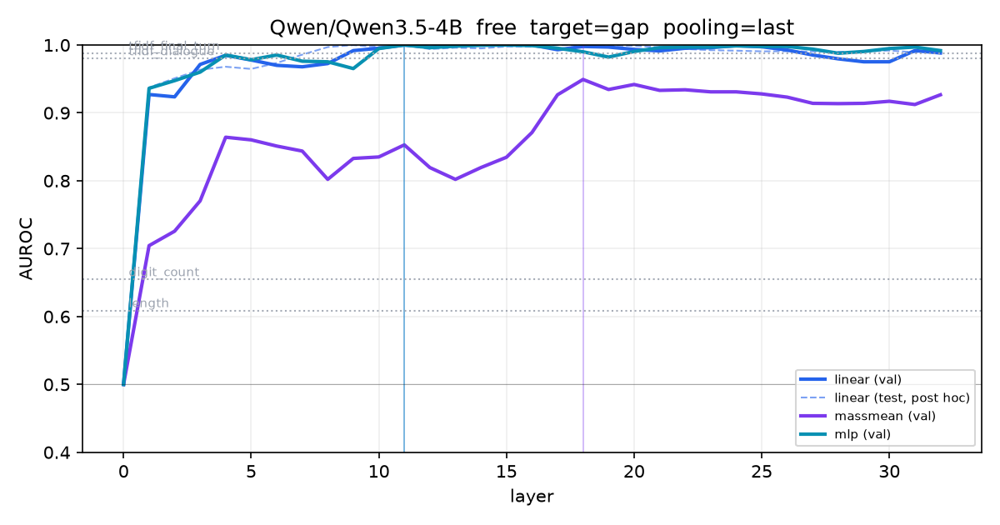
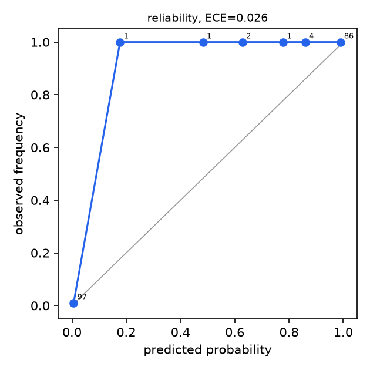
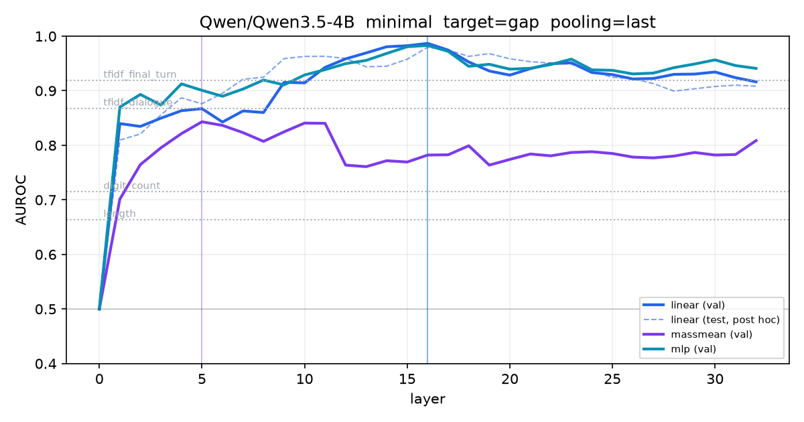
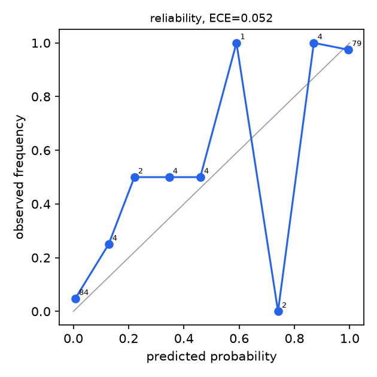
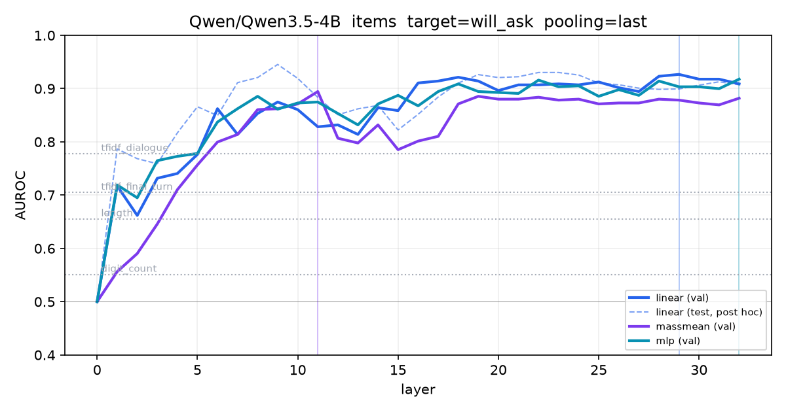
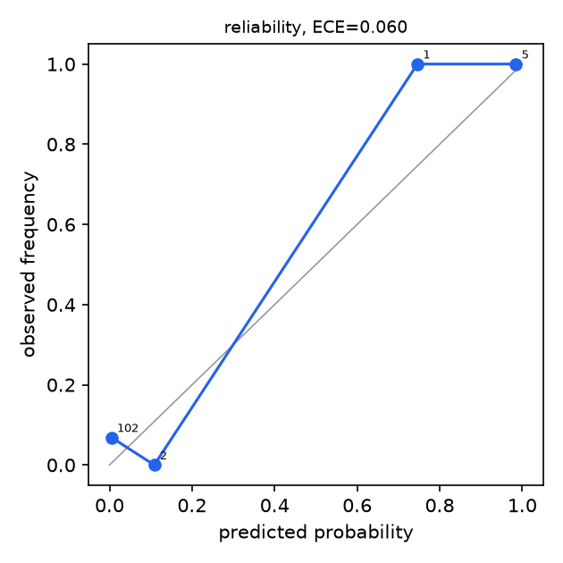
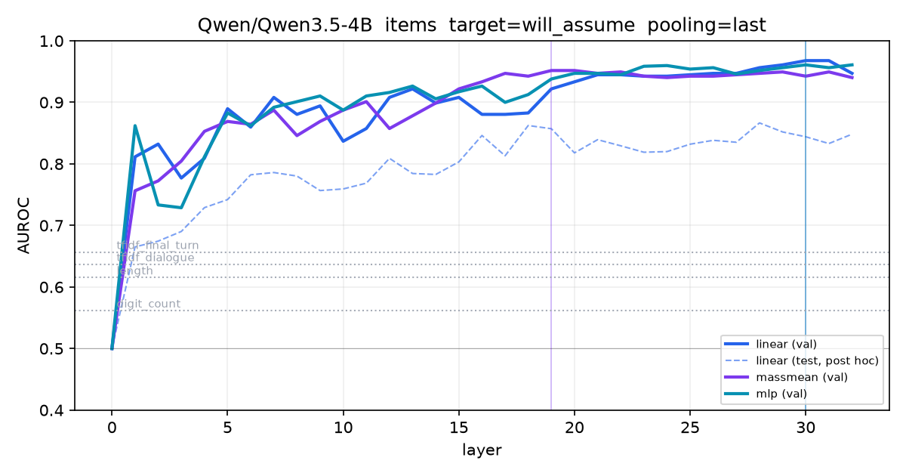
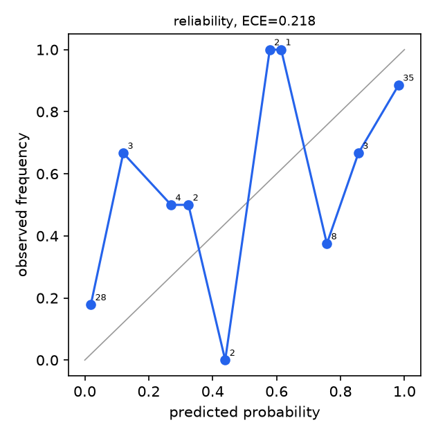

# Results

Generated by `halluscope report`. Intervals are 1000-sample bootstrap 95 percent.

## Does the hidden state beat the words?

Linear, mass-mean and MLP probes against the strongest bag-of-words baseline (TF-IDF on the final turn), resampled together on the same test items. The single-turn pair is decidable from the words by construction, so it is a sanity check; the multi-turn pair is the question.

| dataset | pair | probe | probe AUROC | words AUROC | delta [95% CI] | p | n |
|---|---|---|---|---|---|---|---|
| free | single turn, a vs b | linear | 1.000 | 0.977 | +0.023 [+0.004, +0.049] | 0.012 | 96 |
| free | multi turn, c vs d | linear | 1.000 | 0.997 | +0.003 [+0.000, +0.012] | 0.690 | 96 |
| free | single turn, a vs b | massmean | 0.961 | 0.977 | -0.015 [-0.066, +0.029] | 0.562 | 96 |
| free | multi turn, c vs d | massmean | 0.960 | 0.997 | -0.037 [-0.071, -0.007] | 0.008 | 96 |
| free | single turn, a vs b | mlp | 1.000 | 0.977 | +0.023 [+0.005, +0.050] | 0.012 | 96 |
| free | multi turn, c vs d | mlp | 1.000 | 0.997 | +0.003 [+0.000, +0.012] | 0.692 | 96 |
| minimal | single turn, a vs b | linear | 0.998 | 0.941 | +0.057 [+0.023, +0.102] | 0.000 | 92 |
| minimal | multi turn, c vs d | linear | 0.949 | 0.890 | +0.059 [-0.001, +0.133] | 0.056 | 92 |
| minimal | single turn, a vs b | massmean | 0.979 | 0.941 | +0.038 [+0.006, +0.080] | 0.016 | 92 |
| minimal | multi turn, c vs d | massmean | 0.560 | 0.890 | -0.331 [-0.451, -0.214] | 0.000 | 92 |
| minimal | single turn, a vs b | mlp | 0.996 | 0.941 | +0.055 [+0.022, +0.100] | 0.000 | 92 |
| minimal | multi turn, c vs d | mlp | 0.950 | 0.890 | +0.060 [+0.002, +0.127] | 0.030 | 92 |

## Probes

| dataset | target | probe | layer | AUROC [95% CI] | AUPRC [95% CI] | acc | ECE |
|---|---|---|---|---|---|---|---|
| free | gap | linear | 11/32 | 1.000 [0.999, 1.000] | 1.000 [0.999, 1.000] | 0.984 | 0.026 |
| free | gap | massmean | 18/32 | 0.959 [0.931, 0.982] | 0.968 [0.945, 0.986] | 0.911 | 0.062 |
| free | gap | mlp | 11/32 | 1.000 [1.000, 1.000] | 1.000 [0.999, 1.000] | 0.990 | 0.014 |
| free | gap | baseline: tfidf_dialogue | - | 0.980 [0.961, 0.993] | 0.980 [0.959, 0.994] | 0.917 | 0.347 |
| free | gap | baseline: tfidf_final_turn | - | 0.988 [0.974, 0.997] | 0.987 [0.973, 0.997] | 0.953 | 0.314 |
| free | gap | baseline: length | - | 0.609 [0.535, 0.685] | 0.632 [0.543, 0.724] | nan | nan |
| free | gap | baseline: digit_count | - | 0.654 [0.583, 0.719] | 0.597 [0.507, 0.683] | nan | nan |
| minimal | gap | linear | 16/32 | 0.980 [0.964, 0.994] | 0.980 [0.962, 0.995] | 0.924 | 0.052 |
| minimal | gap | massmean | 5/32 | 0.815 [0.752, 0.872] | 0.848 [0.786, 0.902] | 0.734 | 0.097 |
| minimal | gap | mlp | 16/32 | 0.978 [0.962, 0.992] | 0.978 [0.959, 0.992] | 0.918 | 0.062 |
| minimal | gap | baseline: tfidf_dialogue | - | 0.868 [0.816, 0.915] | 0.865 [0.804, 0.917] | 0.766 | 0.190 |
| minimal | gap | baseline: tfidf_final_turn | - | 0.919 [0.877, 0.954] | 0.902 [0.839, 0.953] | 0.837 | 0.248 |
| minimal | gap | baseline: length | - | 0.664 [0.581, 0.734] | 0.706 [0.620, 0.785] | nan | nan |
| minimal | gap | baseline: digit_count | - | 0.715 [0.648, 0.782] | 0.646 [0.559, 0.733] | nan | nan |
| items | will_ask | linear | 29/32 | 0.899 [0.804, 0.972] | 0.701 [0.470, 0.889] | 0.936 | 0.060 |
| items | will_ask | massmean | 11/32 | 0.893 [0.770, 0.974] | 0.652 [0.406, 0.859] | 0.900 | 0.066 |
| items | will_ask | mlp | 32/32 | 0.931 [0.862, 0.980] | 0.734 [0.508, 0.899] | 0.927 | 0.076 |
| items | will_ask | baseline: tfidf_dialogue | - | 0.778 [0.664, 0.881] | 0.296 [0.154, 0.549] | 0.882 | 0.032 |
| items | will_ask | baseline: tfidf_final_turn | - | 0.705 [0.580, 0.820] | 0.323 [0.120, 0.543] | 0.882 | 0.033 |
| items | will_ask | baseline: length | - | 0.655 [0.482, 0.817] | 0.238 [0.112, 0.492] | nan | nan |
| items | will_ask | baseline: digit_count | - | 0.551 [0.398, 0.683] | 0.131 [0.068, 0.213] | nan | nan |
| items | will_assume | linear | 30/32 | 0.844 [0.746, 0.916] | 0.864 [0.756, 0.939] | 0.773 | 0.218 |
| items | will_assume | massmean | 19/32 | 0.881 [0.799, 0.943] | 0.889 [0.793, 0.957] | 0.795 | 0.128 |
| items | will_assume | mlp | 30/32 | 0.832 [0.740, 0.907] | 0.853 [0.748, 0.934] | 0.705 | 0.241 |
| items | will_assume | baseline: tfidf_dialogue | - | 0.637 [0.533, 0.744] | 0.752 [0.639, 0.848] | 0.568 | 0.123 |
| items | will_assume | baseline: tfidf_final_turn | - | 0.657 [0.545, 0.764] | 0.746 [0.628, 0.843] | 0.580 | 0.097 |
| items | will_assume | baseline: length | - | 0.615 [0.497, 0.732] | 0.651 [0.515, 0.787] | nan | nan |
| items | will_assume | baseline: digit_count | - | 0.562 [0.458, 0.660] | 0.591 [0.478, 0.698] | nan | nan |

### Leave-one-topic-out

| dataset | target | held-out topic | linear probe AUROC [95% CI] | n |
|---|---|---|---|---|
| free | gap | agents | 1.000 [1.000, 1.000] | 92 |
| free | gap | data | 1.000 [1.000, 1.000] | 92 |
| free | gap | evaluation | 1.000 [1.000, 1.000] | 92 |
| free | gap | finetuning | 0.996 [0.986, 1.000] | 96 |
| free | gap | prompting | 0.992 [0.977, 1.000] | 96 |
| free | gap | rag | 0.999 [0.995, 1.000] | 84 |
| free | gap | safety | 0.988 [0.969, 0.999] | 96 |
| free | gap | serving | 1.000 [1.000, 1.000] | 92 |
| minimal | gap | agents | 0.983 [0.957, 0.997] | 92 |
| minimal | gap | data | 0.989 [0.971, 1.000] | 96 |
| minimal | gap | evaluation | 0.961 [0.916, 0.994] | 84 |
| minimal | gap | finetuning | 0.938 [0.882, 0.979] | 84 |
| minimal | gap | prompting | 0.855 [0.776, 0.928] | 96 |
| minimal | gap | rag | 0.962 [0.923, 0.991] | 92 |
| minimal | gap | safety | 0.944 [0.892, 0.979] | 96 |
| minimal | gap | serving | 0.983 [0.957, 1.000] | 88 |
| items | will_ask | agents | 0.983 [0.961, 0.997] | 124 |
| items | will_ask | data | 0.749 [0.568, 0.934] | 122 |
| items | will_ask | evaluation | 0.921 [0.817, 0.989] | 32 |
| items | will_ask | finetuning | 0.917 [0.820, 1.000] | 32 |
| items | will_ask | prompting | 0.955 [0.875, 1.000] | 32 |
| items | will_ask | rag | 1.000 [1.000, 1.000] | 32 |
| items | will_ask | safety | 0.933 [0.793, 1.000] | 32 |
| items | will_ask | serving | 1.000 [1.000, 1.000] | 32 |
| items | will_assume | agents | 0.781 [0.689, 0.859] | 124 |
| items | will_assume | data | 0.846 [0.723, 0.958] | 46 |
| items | will_assume | evaluation | 0.818 [0.656, 0.955] | 32 |
| items | will_assume | finetuning | 0.850 [0.669, 0.990] | 32 |
| items | will_assume | prompting | 0.757 [0.543, 0.933] | 32 |
| items | will_assume | rag | 0.727 [0.526, 0.897] | 32 |
| items | will_assume | safety | 0.917 [0.779, 1.000] | 32 |
| items | will_assume | serving | 0.791 [0.573, 0.956] | 32 |

## Model behavior (asked, flagged, silently assumed)

| model | label | n | asked | flagged | silently assumed |
|---|---|---|---|---|---|
| Qwen/Qwen3.5-4B | specified | 262 | 0.08 | 0.27 | 0.40 |
| Qwen/Qwen3.5-4B | underspecified | 131 | 0.18 | 0.07 | 0.70 |
| Qwen/Qwen3.5-4B | inconsistent | 130 | 0.16 | 0.32 | 0.57 |
| Qwen/Qwen3.5-4B | judge agreement (kappa, silently assumed) | 523 | | | 0.55 |

## Figures

