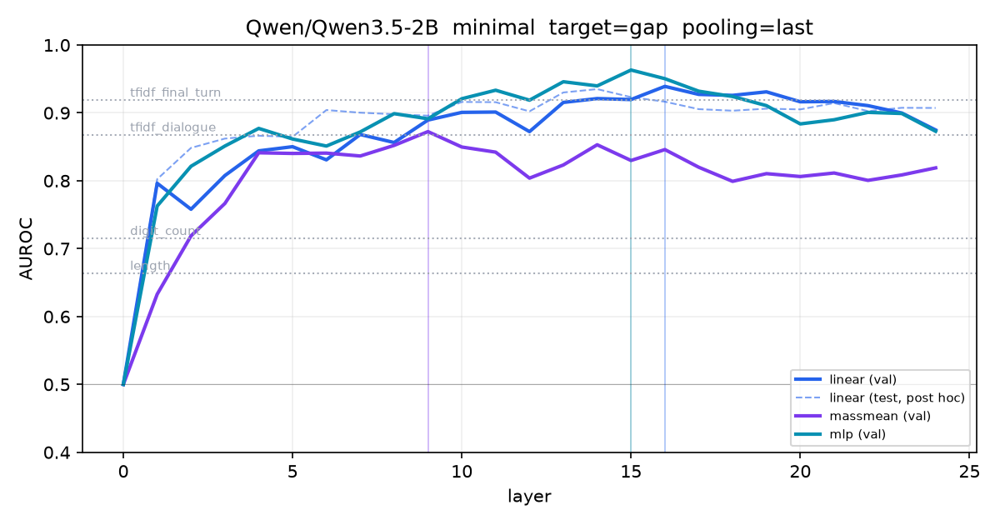
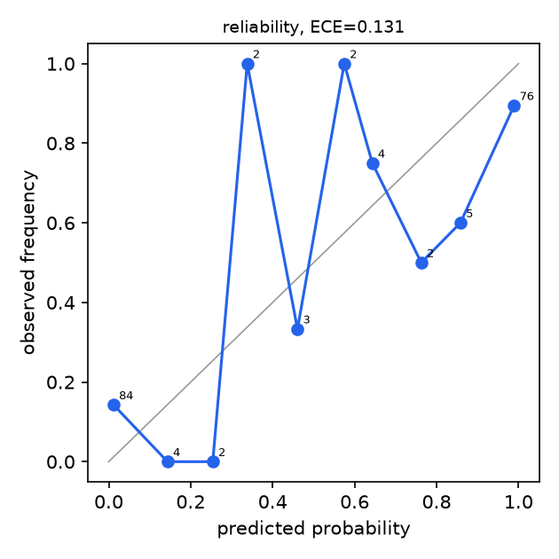
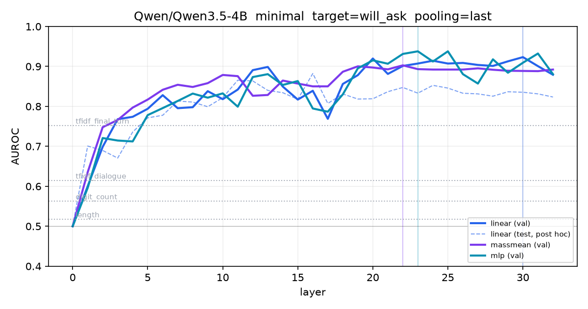
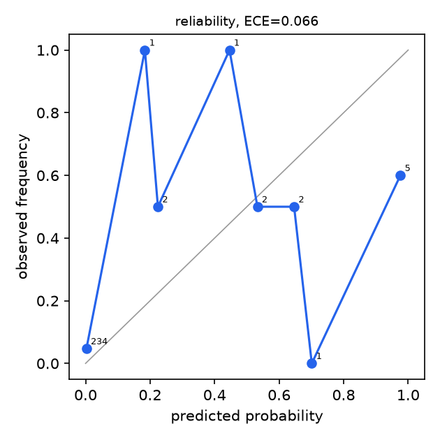
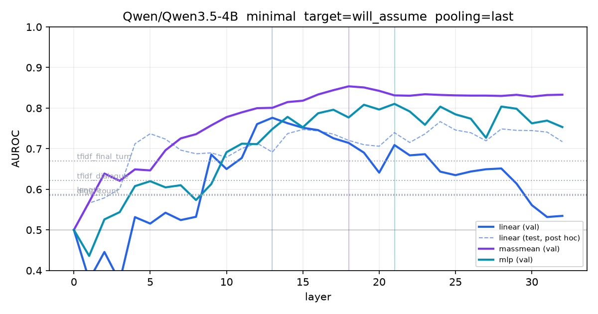
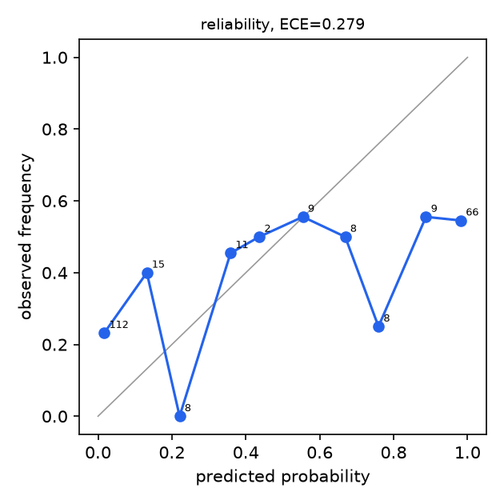
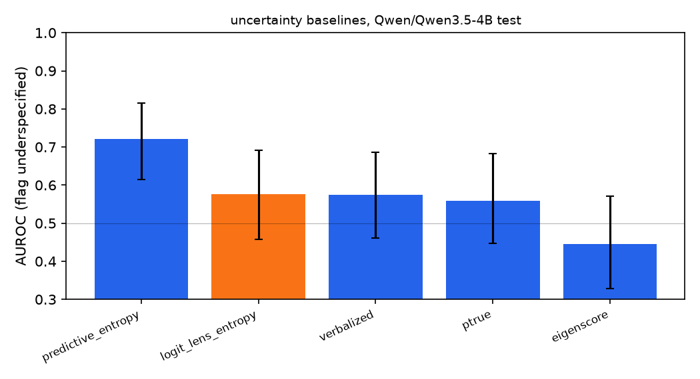
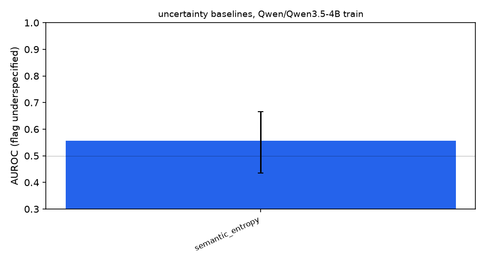

# Results

Generated by `halluscope report`. Intervals are 1000-sample bootstrap 95 percent.

## Does the hidden state beat the words?

Linear, mass-mean and MLP probes against the strongest bag-of-words baseline (TF-IDF on the final turn), resampled together on the same test items. The single-turn pair is decidable from the words by construction, so it is a sanity check; the multi-turn pair is the question.

| model | dataset | target | pair | probe | probe AUROC | words AUROC | delta [95% CI] | p | n |
|---|---|---|---|---|---|---|---|---|---|
| Qwen3.5-2B | minimal | gap | single turn, a vs b | linear | 0.975 | 0.941 | +0.034 [-0.006, +0.081] | 0.110 | 92 |
| Qwen3.5-2B | minimal | gap | multi turn, c vs d | linear | 0.842 | 0.890 | -0.049 [-0.133, +0.032] | 0.260 | 92 |
| Qwen3.5-2B | minimal | gap | single turn, a vs b | massmean | 0.971 | 0.941 | +0.030 [-0.010, +0.074] | 0.152 | 92 |
| Qwen3.5-2B | minimal | gap | multi turn, c vs d | massmean | 0.621 | 0.890 | -0.269 [-0.386, -0.153] | 0.000 | 92 |
| Qwen3.5-2B | minimal | gap | single turn, a vs b | mlp | 0.980 | 0.941 | +0.039 [-0.002, +0.085] | 0.060 | 92 |
| Qwen3.5-2B | minimal | gap | multi turn, c vs d | mlp | 0.836 | 0.890 | -0.054 [-0.148, +0.036] | 0.270 | 92 |
| Qwen3.5-4B | free | gap | single turn, a vs b | linear | 1.000 | 0.977 | +0.023 [+0.004, +0.049] | 0.012 | 96 |
| Qwen3.5-4B | free | gap | multi turn, c vs d | linear | 1.000 | 0.997 | +0.003 [+0.000, +0.012] | 0.690 | 96 |
| Qwen3.5-4B | free | gap | single turn, a vs b | massmean | 0.961 | 0.977 | -0.015 [-0.066, +0.029] | 0.562 | 96 |
| Qwen3.5-4B | free | gap | multi turn, c vs d | massmean | 0.960 | 0.997 | -0.037 [-0.071, -0.007] | 0.008 | 96 |
| Qwen3.5-4B | free | gap | single turn, a vs b | mlp | 1.000 | 0.977 | +0.023 [+0.005, +0.050] | 0.012 | 96 |
| Qwen3.5-4B | free | gap | multi turn, c vs d | mlp | 1.000 | 0.997 | +0.003 [+0.000, +0.012] | 0.692 | 96 |
| Qwen3.5-4B | minimal | gap | single turn, a vs b | linear | 0.998 | 0.941 | +0.057 [+0.023, +0.102] | 0.000 | 92 |
| Qwen3.5-4B | minimal | gap | multi turn, c vs d | linear | 0.949 | 0.890 | +0.059 [-0.001, +0.133] | 0.056 | 92 |
| Qwen3.5-4B | minimal | gap | single turn, a vs b | massmean | 0.979 | 0.941 | +0.038 [+0.006, +0.080] | 0.016 | 92 |
| Qwen3.5-4B | minimal | gap | multi turn, c vs d | massmean | 0.560 | 0.890 | -0.331 [-0.451, -0.214] | 0.000 | 92 |
| Qwen3.5-4B | minimal | gap | single turn, a vs b | mlp | 0.996 | 0.941 | +0.055 [+0.022, +0.100] | 0.000 | 92 |
| Qwen3.5-4B | minimal | gap | multi turn, c vs d | mlp | 0.950 | 0.890 | +0.060 [+0.002, +0.127] | 0.030 | 92 |
| Qwen3.5-4B | minimal | will_ask | single turn, a vs b | linear | 0.890 | 0.700 | +0.190 [-0.096, +0.446] | 0.146 | 124 |
| Qwen3.5-4B | minimal | will_ask | multi turn, c vs d | linear | 0.785 | 0.787 | -0.002 [-0.220, +0.169] | 1.000 | 124 |
| Qwen3.5-4B | minimal | will_ask | single turn, a vs b | massmean | 0.965 | 0.700 | +0.266 [+0.075, +0.497] | 0.002 | 124 |
| Qwen3.5-4B | minimal | will_ask | multi turn, c vs d | massmean | 0.841 | 0.787 | +0.054 [-0.127, +0.223] | 0.466 | 124 |
| Qwen3.5-4B | minimal | will_ask | single turn, a vs b | mlp | 0.918 | 0.700 | +0.218 [-0.018, +0.442] | 0.068 | 124 |
| Qwen3.5-4B | minimal | will_ask | multi turn, c vs d | mlp | 0.827 | 0.787 | +0.040 [-0.195, +0.239] | 0.628 | 124 |
| Qwen3.5-4B | minimal | will_assume | single turn, a vs b | linear | 0.740 | 0.677 | +0.063 [-0.057, +0.183] | 0.318 | 124 |
| Qwen3.5-4B | minimal | will_assume | multi turn, c vs d | linear | 0.640 | 0.642 | -0.003 [-0.137, +0.111] | 0.922 | 124 |
| Qwen3.5-4B | minimal | will_assume | single turn, a vs b | massmean | 0.826 | 0.677 | +0.149 [+0.044, +0.253] | 0.006 | 124 |
| Qwen3.5-4B | minimal | will_assume | multi turn, c vs d | massmean | 0.685 | 0.642 | +0.042 [-0.079, +0.169] | 0.524 | 124 |
| Qwen3.5-4B | minimal | will_assume | single turn, a vs b | mlp | 0.812 | 0.677 | +0.135 [+0.029, +0.246] | 0.014 | 124 |
| Qwen3.5-4B | minimal | will_assume | multi turn, c vs d | mlp | 0.755 | 0.642 | +0.112 [+0.001, +0.226] | 0.050 | 124 |

## Probes

| model | dataset | target | probe | layer | AUROC [95% CI] | AUPRC [95% CI] | acc | ECE |
|---|---|---|---|---|---|---|---|---|
| Qwen3.5-2B | minimal | gap | linear | 16/24 | 0.916 [0.875, 0.951] | 0.919 [0.874, 0.956] | 0.853 | 0.131 |
| Qwen3.5-2B | minimal | gap | massmean | 9/24 | 0.829 [0.771, 0.882] | 0.843 [0.776, 0.896] | 0.707 | 0.094 |
| Qwen3.5-2B | minimal | gap | mlp | 15/24 | 0.919 [0.877, 0.954] | 0.932 [0.893, 0.962] | 0.837 | 0.146 |
| Qwen3.5-2B | minimal | gap | baseline: tfidf_dialogue | - | 0.868 [0.816, 0.915] | 0.865 [0.804, 0.917] | 0.766 | 0.190 |
| Qwen3.5-2B | minimal | gap | baseline: tfidf_final_turn | - | 0.919 [0.877, 0.954] | 0.902 [0.839, 0.953] | 0.837 | 0.248 |
| Qwen3.5-2B | minimal | gap | baseline: length | - | 0.664 [0.581, 0.734] | 0.706 [0.620, 0.785] | nan | nan |
| Qwen3.5-2B | minimal | gap | baseline: digit_count | - | 0.715 [0.648, 0.782] | 0.646 [0.559, 0.733] | nan | nan |
| Qwen3.5-4B | free | gap | linear | 11/32 | 1.000 [0.999, 1.000] | 1.000 [0.999, 1.000] | 0.984 | 0.026 |
| Qwen3.5-4B | free | gap | massmean | 18/32 | 0.959 [0.931, 0.982] | 0.968 [0.945, 0.986] | 0.911 | 0.062 |
| Qwen3.5-4B | free | gap | mlp | 11/32 | 1.000 [1.000, 1.000] | 1.000 [0.999, 1.000] | 0.990 | 0.014 |
| Qwen3.5-4B | free | gap | baseline: tfidf_dialogue | - | 0.980 [0.961, 0.993] | 0.980 [0.959, 0.994] | 0.917 | 0.347 |
| Qwen3.5-4B | free | gap | baseline: tfidf_final_turn | - | 0.988 [0.974, 0.997] | 0.987 [0.973, 0.997] | 0.953 | 0.314 |
| Qwen3.5-4B | free | gap | baseline: length | - | 0.609 [0.535, 0.685] | 0.632 [0.543, 0.724] | nan | nan |
| Qwen3.5-4B | free | gap | baseline: digit_count | - | 0.654 [0.583, 0.719] | 0.597 [0.507, 0.683] | nan | nan |
| Qwen3.5-4B | minimal | gap | linear | 16/32 | 0.980 [0.964, 0.994] | 0.980 [0.962, 0.995] | 0.924 | 0.052 |
| Qwen3.5-4B | minimal | gap | massmean | 5/32 | 0.815 [0.752, 0.872] | 0.848 [0.786, 0.902] | 0.734 | 0.097 |
| Qwen3.5-4B | minimal | gap | mlp | 16/32 | 0.978 [0.962, 0.992] | 0.978 [0.959, 0.992] | 0.918 | 0.062 |
| Qwen3.5-4B | minimal | gap | baseline: tfidf_dialogue | - | 0.868 [0.816, 0.915] | 0.865 [0.804, 0.917] | 0.766 | 0.190 |
| Qwen3.5-4B | minimal | gap | baseline: tfidf_final_turn | - | 0.919 [0.877, 0.954] | 0.902 [0.839, 0.953] | 0.837 | 0.248 |
| Qwen3.5-4B | minimal | gap | baseline: length | - | 0.664 [0.581, 0.734] | 0.706 [0.620, 0.785] | nan | nan |
| Qwen3.5-4B | minimal | gap | baseline: digit_count | - | 0.715 [0.648, 0.782] | 0.646 [0.559, 0.733] | nan | nan |
| Qwen3.5-4B | items | will_ask | linear | 29/32 | 0.899 [0.804, 0.972] | 0.701 [0.470, 0.889] | 0.936 | 0.060 |
| Qwen3.5-4B | items | will_ask | massmean | 11/32 | 0.893 [0.770, 0.974] | 0.652 [0.406, 0.859] | 0.900 | 0.066 |
| Qwen3.5-4B | items | will_ask | mlp | 32/32 | 0.931 [0.862, 0.980] | 0.734 [0.508, 0.899] | 0.927 | 0.076 |
| Qwen3.5-4B | items | will_ask | baseline: tfidf_dialogue | - | 0.778 [0.664, 0.881] | 0.296 [0.154, 0.549] | 0.882 | 0.032 |
| Qwen3.5-4B | items | will_ask | baseline: tfidf_final_turn | - | 0.705 [0.580, 0.820] | 0.323 [0.120, 0.543] | 0.882 | 0.033 |
| Qwen3.5-4B | items | will_ask | baseline: length | - | 0.655 [0.482, 0.817] | 0.238 [0.112, 0.492] | nan | nan |
| Qwen3.5-4B | items | will_ask | baseline: digit_count | - | 0.551 [0.398, 0.683] | 0.131 [0.068, 0.213] | nan | nan |
| Qwen3.5-4B | minimal | will_ask | linear | 30/32 | 0.835 [0.713, 0.927] | 0.432 [0.233, 0.647] | 0.923 | 0.066 |
| Qwen3.5-4B | minimal | will_ask | massmean | 22/32 | 0.883 [0.809, 0.943] | 0.551 [0.335, 0.735] | 0.948 | 0.034 |
| Qwen3.5-4B | minimal | will_ask | mlp | 23/32 | 0.865 [0.747, 0.951] | 0.533 [0.319, 0.718] | 0.911 | 0.077 |
| Qwen3.5-4B | minimal | will_ask | baseline: tfidf_dialogue | - | 0.614 [0.494, 0.734] | 0.125 [0.072, 0.237] | 0.923 | 0.022 |
| Qwen3.5-4B | minimal | will_ask | baseline: tfidf_final_turn | - | 0.752 [0.628, 0.852] | 0.186 [0.108, 0.365] | 0.923 | 0.013 |
| Qwen3.5-4B | minimal | will_ask | baseline: length | - | 0.517 [0.373, 0.662] | 0.124 [0.055, 0.279] | nan | nan |
| Qwen3.5-4B | minimal | will_ask | baseline: digit_count | - | 0.563 [0.460, 0.658] | 0.087 [0.053, 0.133] | nan | nan |
| Qwen3.5-4B | items | will_assume | linear | 30/32 | 0.844 [0.746, 0.916] | 0.864 [0.756, 0.939] | 0.773 | 0.218 |
| Qwen3.5-4B | items | will_assume | massmean | 19/32 | 0.881 [0.799, 0.943] | 0.889 [0.793, 0.957] | 0.795 | 0.128 |
| Qwen3.5-4B | items | will_assume | mlp | 30/32 | 0.832 [0.740, 0.907] | 0.853 [0.748, 0.934] | 0.705 | 0.241 |
| Qwen3.5-4B | items | will_assume | baseline: tfidf_dialogue | - | 0.637 [0.533, 0.744] | 0.752 [0.639, 0.848] | 0.568 | 0.123 |
| Qwen3.5-4B | items | will_assume | baseline: tfidf_final_turn | - | 0.657 [0.545, 0.764] | 0.746 [0.628, 0.843] | 0.580 | 0.097 |
| Qwen3.5-4B | items | will_assume | baseline: length | - | 0.615 [0.497, 0.732] | 0.651 [0.515, 0.787] | nan | nan |
| Qwen3.5-4B | items | will_assume | baseline: digit_count | - | 0.562 [0.458, 0.660] | 0.591 [0.478, 0.698] | nan | nan |
| Qwen3.5-4B | minimal | will_assume | linear | 13/32 | 0.692 [0.623, 0.763] | 0.551 [0.451, 0.669] | 0.653 | 0.279 |
| Qwen3.5-4B | minimal | will_assume | massmean | 18/32 | 0.757 [0.700, 0.814] | 0.614 [0.515, 0.717] | 0.677 | 0.088 |
| Qwen3.5-4B | minimal | will_assume | mlp | 21/32 | 0.786 [0.725, 0.844] | 0.647 [0.546, 0.756] | 0.730 | 0.205 |
| Qwen3.5-4B | minimal | will_assume | baseline: tfidf_dialogue | - | 0.622 [0.550, 0.692] | 0.515 [0.417, 0.617] | 0.649 | 0.115 |
| Qwen3.5-4B | minimal | will_assume | baseline: tfidf_final_turn | - | 0.670 [0.604, 0.740] | 0.521 [0.430, 0.642] | 0.673 | 0.102 |
| Qwen3.5-4B | minimal | will_assume | baseline: length | - | 0.587 [0.516, 0.652] | 0.419 [0.342, 0.518] | nan | nan |
| Qwen3.5-4B | minimal | will_assume | baseline: digit_count | - | 0.585 [0.521, 0.650] | 0.415 [0.336, 0.493] | nan | nan |

### Leave-one-topic-out

| model | dataset | target | held-out topic | linear probe AUROC [95% CI] | n |
|---|---|---|---|---|---|
| Qwen3.5-2B | minimal | gap | agents | 0.929 [0.867, 0.975] | 92 |
| Qwen3.5-2B | minimal | gap | data | 0.915 [0.857, 0.964] | 96 |
| Qwen3.5-2B | minimal | gap | evaluation | 0.914 [0.844, 0.964] | 84 |
| Qwen3.5-2B | minimal | gap | finetuning | 0.937 [0.880, 0.975] | 84 |
| Qwen3.5-2B | minimal | gap | prompting | 0.756 [0.654, 0.840] | 96 |
| Qwen3.5-2B | minimal | gap | rag | 0.957 [0.913, 0.989] | 92 |
| Qwen3.5-2B | minimal | gap | safety | 0.896 [0.828, 0.950] | 96 |
| Qwen3.5-2B | minimal | gap | serving | 0.967 [0.930, 0.995] | 88 |
| Qwen3.5-4B | free | gap | agents | 1.000 [1.000, 1.000] | 92 |
| Qwen3.5-4B | free | gap | data | 1.000 [1.000, 1.000] | 92 |
| Qwen3.5-4B | free | gap | evaluation | 1.000 [1.000, 1.000] | 92 |
| Qwen3.5-4B | free | gap | finetuning | 0.996 [0.986, 1.000] | 96 |
| Qwen3.5-4B | free | gap | prompting | 0.992 [0.977, 1.000] | 96 |
| Qwen3.5-4B | free | gap | rag | 0.999 [0.995, 1.000] | 84 |
| Qwen3.5-4B | free | gap | safety | 0.988 [0.969, 0.999] | 96 |
| Qwen3.5-4B | free | gap | serving | 1.000 [1.000, 1.000] | 92 |
| Qwen3.5-4B | minimal | gap | agents | 0.983 [0.957, 0.997] | 92 |
| Qwen3.5-4B | minimal | gap | data | 0.989 [0.971, 1.000] | 96 |
| Qwen3.5-4B | minimal | gap | evaluation | 0.961 [0.916, 0.994] | 84 |
| Qwen3.5-4B | minimal | gap | finetuning | 0.938 [0.882, 0.979] | 84 |
| Qwen3.5-4B | minimal | gap | prompting | 0.855 [0.776, 0.928] | 96 |
| Qwen3.5-4B | minimal | gap | rag | 0.962 [0.923, 0.991] | 92 |
| Qwen3.5-4B | minimal | gap | safety | 0.944 [0.892, 0.979] | 96 |
| Qwen3.5-4B | minimal | gap | serving | 0.983 [0.957, 1.000] | 88 |
| Qwen3.5-4B | items | will_ask | agents | 0.983 [0.961, 0.997] | 124 |
| Qwen3.5-4B | items | will_ask | data | 0.749 [0.568, 0.934] | 122 |
| Qwen3.5-4B | items | will_ask | evaluation | 0.921 [0.817, 0.989] | 32 |
| Qwen3.5-4B | items | will_ask | finetuning | 0.917 [0.820, 1.000] | 32 |
| Qwen3.5-4B | items | will_ask | prompting | 0.955 [0.875, 1.000] | 32 |
| Qwen3.5-4B | items | will_ask | rag | 1.000 [1.000, 1.000] | 32 |
| Qwen3.5-4B | items | will_ask | safety | 0.933 [0.793, 1.000] | 32 |
| Qwen3.5-4B | items | will_ask | serving | 1.000 [1.000, 1.000] | 32 |
| Qwen3.5-4B | minimal | will_ask | agents | 0.993 [0.978, 1.000] | 124 |
| Qwen3.5-4B | minimal | will_ask | data | 0.724 [0.437, 0.943] | 128 |
| Qwen3.5-4B | minimal | will_ask | evaluation | 0.912 [0.851, 0.965] | 116 |
| Qwen3.5-4B | minimal | will_ask | finetuning | 0.926 [0.848, 0.995] | 116 |
| Qwen3.5-4B | minimal | will_ask | prompting | 0.885 [0.821, 0.940] | 128 |
| Qwen3.5-4B | minimal | will_ask | rag | 0.980 [0.933, 1.000] | 124 |
| Qwen3.5-4B | minimal | will_ask | safety | 0.592 [0.346, 0.799] | 128 |
| Qwen3.5-4B | minimal | will_ask | serving | 0.945 [0.881, 0.992] | 120 |
| Qwen3.5-4B | items | will_assume | agents | 0.781 [0.689, 0.859] | 124 |
| Qwen3.5-4B | items | will_assume | data | 0.846 [0.723, 0.958] | 46 |
| Qwen3.5-4B | items | will_assume | evaluation | 0.818 [0.656, 0.955] | 32 |
| Qwen3.5-4B | items | will_assume | finetuning | 0.850 [0.669, 0.990] | 32 |
| Qwen3.5-4B | items | will_assume | prompting | 0.757 [0.543, 0.933] | 32 |
| Qwen3.5-4B | items | will_assume | rag | 0.727 [0.526, 0.897] | 32 |
| Qwen3.5-4B | items | will_assume | safety | 0.917 [0.779, 1.000] | 32 |
| Qwen3.5-4B | items | will_assume | serving | 0.791 [0.573, 0.956] | 32 |
| Qwen3.5-4B | minimal | will_assume | agents | 0.646 [0.552, 0.740] | 124 |
| Qwen3.5-4B | minimal | will_assume | data | 0.677 [0.582, 0.766] | 128 |
| Qwen3.5-4B | minimal | will_assume | evaluation | 0.666 [0.560, 0.760] | 116 |
| Qwen3.5-4B | minimal | will_assume | finetuning | 0.642 [0.546, 0.740] | 116 |
| Qwen3.5-4B | minimal | will_assume | prompting | 0.687 [0.587, 0.783] | 128 |
| Qwen3.5-4B | minimal | will_assume | rag | 0.692 [0.594, 0.783] | 124 |
| Qwen3.5-4B | minimal | will_assume | safety | 0.811 [0.728, 0.881] | 128 |
| Qwen3.5-4B | minimal | will_assume | serving | 0.616 [0.515, 0.713] | 120 |

## Model behavior (asked, flagged, silently assumed)

| model | label | n | asked | flagged | silently assumed |
|---|---|---|---|---|---|
| Qwen/Qwen3.5-4B | specified | 262 | 0.08 | 0.27 | 0.40 |
| Qwen/Qwen3.5-4B | underspecified | 131 | 0.18 | 0.07 | 0.70 |
| Qwen/Qwen3.5-4B | inconsistent | 130 | 0.16 | 0.32 | 0.57 |
| Qwen/Qwen3.5-4B | judge agreement (kappa, silently assumed) | 523 | | | 0.55 |
| Qwen/Qwen3.5-4B | specified | 492 | 0.08 | 0.06 | 0.25 |
| Qwen/Qwen3.5-4B | underspecified | 246 | 0.11 | 0.01 | 0.57 |
| Qwen/Qwen3.5-4B | inconsistent | 246 | 0.10 | 0.17 | 0.61 |
| Qwen/Qwen3.5-4B | judge agreement (kappa, silently assumed) | 984 | | | 0.66 |

## Uncertainty baselines

| model | split | method | AUROC [95% CI] | AUPRC [95% CI] | generations | mean seconds/item |
|---|---|---|---|---|---|---|
| Qwen/Qwen3.5-4B | test | predictive_entropy | 0.721 [0.615, 0.816] | 0.686 [0.553, 0.835] | 1 | 26.21 |
| Qwen/Qwen3.5-4B | test | semantic_entropy | 0.640 [0.527, 0.744] | 0.607 [0.485, 0.753] | 6 | 70.47 |
| Qwen/Qwen3.5-4B | test | logit_lens_entropy | 0.577 [0.457, 0.692] | 0.607 [0.461, 0.747] | 0 | 0.50 |
| Qwen/Qwen3.5-4B | test | verbalized | 0.575 [0.461, 0.686] | 0.572 [0.435, 0.702] | 1 | 0.98 |
| Qwen/Qwen3.5-4B | test | ptrue | 0.559 [0.447, 0.682] | 0.581 [0.450, 0.733] | 1 | 26.54 |
| Qwen/Qwen3.5-4B | test | sep | 0.510 [0.394, 0.622] | 0.545 [0.414, 0.689] | 0 | 0.00 |
| Qwen/Qwen3.5-4B | test | eigenscore | 0.445 [0.328, 0.571] | 0.504 [0.371, 0.642] | 6 | 52.23 |
| Qwen/Qwen3.5-4B | train | semantic_entropy | 0.556 [0.435, 0.665] | 0.530 [0.400, 0.672] | 6 | 71.31 |

## Clarify gate, simulated-user loop

| model | condition | run | label | n | correct | partial or better | assumption rate | questions/task |
|---|---|---|---|---|---|---|---|---|
| Qwen/Qwen3.5-4B | always | 0 | all | 48 | 0.12 | 0.50 | 0.33 | 1.00 |
| Qwen/Qwen3.5-4B | always | 0 | specified | 24 | 0.17 | 0.62 | 0.29 | 1.00 |
| Qwen/Qwen3.5-4B | always | 0 | underspecified | 12 | 0.17 | 0.42 | 0.42 | 1.00 |
| Qwen/Qwen3.5-4B | always | 0 | inconsistent | 12 | 0.00 | 0.33 | 0.33 | 1.00 |
| Qwen/Qwen3.5-4B | gate | 0 | all | 48 | 0.08 | 0.50 | 0.35 | 0.98 |
| Qwen/Qwen3.5-4B | gate | 0 | specified | 24 | 0.12 | 0.58 | 0.33 | 0.00 |
| Qwen/Qwen3.5-4B | gate | 0 | underspecified | 12 | 0.08 | 0.42 | 0.25 | 1.92 |
| Qwen/Qwen3.5-4B | gate | 0 | inconsistent | 12 | 0.00 | 0.42 | 0.50 | 2.00 |
| Qwen/Qwen3.5-4B | off | 0 | all | 48 | 0.08 | 0.31 | 0.40 | 0.00 |
| Qwen/Qwen3.5-4B | off | 0 | specified | 24 | 0.17 | 0.38 | 0.38 | 0.00 |
| Qwen/Qwen3.5-4B | off | 0 | underspecified | 12 | 0.00 | 0.08 | 0.33 | 0.00 |
| Qwen/Qwen3.5-4B | off | 0 | inconsistent | 12 | 0.00 | 0.42 | 0.50 | 0.00 |
| Qwen/Qwen3.5-4B | prompt | 0 | all | 48 | 0.06 | 0.23 | 0.21 | 0.25 |
| Qwen/Qwen3.5-4B | prompt | 0 | specified | 24 | 0.04 | 0.29 | 0.12 | 0.29 |
| Qwen/Qwen3.5-4B | prompt | 0 | underspecified | 12 | 0.08 | 0.08 | 0.33 | 0.25 |
| Qwen/Qwen3.5-4B | prompt | 0 | inconsistent | 12 | 0.08 | 0.25 | 0.25 | 0.17 |

## Cross-model transfer

| dataset | source | target | reading | layer | AUROC [95% CI] | single turn | multi turn | CKA |
|---|---|---|---|---|---|---|---|---|
| minimal | qwen | qwen2b | source at its best layer | 16 | 0.980 [0.964, 0.994] | 0.998 [0.992, 1.000] | 0.949 [0.897, 0.984] |  |
| minimal | qwen | qwen2b | target at matched depth | 12 | 0.902 [0.859, 0.942] | 0.986 [0.966, 0.999] | 0.790 [0.687, 0.873] | 0.677 |
| minimal | qwen | qwen2b | target at its own best | 16 | 0.916 [0.875, 0.951] | 0.975 [0.945, 0.994] | 0.842 [0.755, 0.910] | 0.764 |

## Is the probe reading format?

Surface features are regressed out of the activations before the probe is re-fit, so a linear readout of length, digit count or wording cannot supply what is left.

Model Qwen/Qwen3.5-4B, minimal build, 184 test items. Each block is regressed out of the activations with a map fit on the training split only, then the probe is re-selected and re-fit on the residuals. The unmodified probe at layer 16 scores 0.980 [0.964, 0.994] and the strongest bag-of-words baseline is tfidf_final_turn.

| removed | features | features alone | layer | AUROC | vs unmodified probe | vs words | vs words, multi turn |
|---|---|---|---|---|---|---|---|
| length_digits | 7 | 0.741 | 16 | 0.937 [0.899, 0.969] | -0.043 (p=0.00) | +0.018 (p=0.38) | +0.027 (p=0.44) |
| surface | 13 | 0.760 | 16 | 0.936 [0.897, 0.969] | -0.044 (p=0.00) | +0.017 (p=0.36) | +0.031 (p=0.34) |
| surface_lexical | 63 | 0.766 | 17 | 0.864 [0.811, 0.916] | -0.116 (p=0.00) | -0.055 (p=0.08) | -0.009 (p=0.79) |

## Activation steering

Model Qwen/Qwen3.5-4B, minimal build, layer 16, 32 test items (16 specified, 16 with a gap). Alpha is in train-set standard deviations along the mass-mean direction; cells are the fraction of steered replies that ask a clarifying question.

| label | -2.0 | -1.0 | +0.0 | +1.0 | +2.0 |
|---|---|---|---|---|---|
| specified | 0.25 | 0.25 | 0.00 | 0.00 | 0.00 |
| underspecified | 0.00 | 0.00 | 0.00 | 0.00 | 0.00 |
| inconsistent | 0.12 | 0.25 | 0.12 | 0.00 | 0.00 |
| all | 0.16 | 0.19 | 0.03 | 0.00 | 0.00 |

Random-direction control: 3 directions drawn uniformly on the unit sphere, pushed at the same layer, on the same items, with the same push norm. Alpha zero applies no push and is shared. A flat curve on both rows means the push was too weak to move behavior at all; a flat probe row under a moving random row would mean the direction is worse than chance at causing asking.

| direction | -2.0 | -1.0 | +0.0 | +1.0 | +2.0 |
|---|---|---|---|---|---|
| probe, all items | 0.16 | 0.19 | 0.03 | 0.00 | 0.00 |
| random, all items | 0.09 | 0.08 | 0.03 | 0.05 | 0.09 |
| mean reply characters, probe | 610 | 612 | 653 | 654 | 638 |
| mean reply characters, random | 631 | 654 | 653 | 658 | 654 |

Paired difference in asking rate, probe direction minus random, bootstrapped over the same items.

| alpha | probe | random | delta | 95% CI | p |
|---|---|---|---|---|---|
| -2.0 | 0.16 | 0.09 | +0.06 | [-0.08, +0.20] | 0.444 |
| -1.0 | 0.19 | 0.08 | +0.10 | [+0.00, +0.23] | 0.072 |
| +1.0 | 0.00 | 0.05 | -0.05 | [-0.11, +0.00] | 0.098 |
| +2.0 | 0.00 | 0.09 | -0.09 | [-0.17, -0.03] | 0.002 |

The 3 control directions are near orthogonal to the probe, largest absolute cosine 0.016, so a difference between the rows is about where the push points and not about overlap with the probe itself. Random pushes alone move the asking rate off its unpushed baseline of 0.03 at 4 of the 4 nonzero alphas, which is the norm artifact the control was built to expose. The probe separates from the control at alpha +2.0 at -0.09 with 95% CI [-0.17, -0.03] and p 0.002. At alpha -2.0, alpha -1.0, alpha +1.0 the confidence interval includes zero, so the probe is not distinguishable from a random push of the same size and no causal claim is made there.

## Figures

